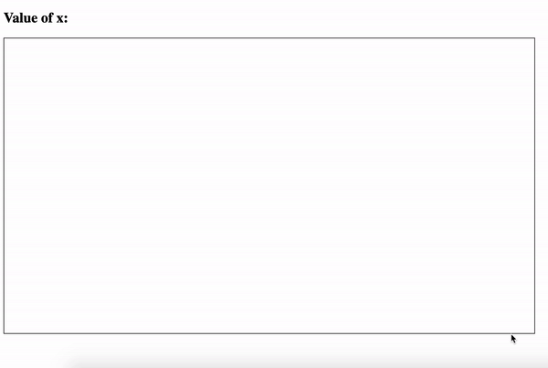

# Bezier curve implementation

## Introduction

This repostory shows different techniques to draw curves and lines which are used in computer graphics.

-   [Draw Line based on middle points](#draw-line-based-on-middle-points)
-   [Draw Line based on bezier method](#draw-line-based-on-bezier-method)
-   [Draw Curves based on bezier method](#draw-curves-based-on-bezier-method)

# Draw Line based on middle points


This method does not require a lot of explanation, cause it is so straight forward technique. When we want to use this technique, we just define two points and recursively find middle points. In my case, count of iterations is 5.

```javascript
function recursive(point1, point2, iter) {
    if (iter == 0) {
        return 1;
    }

    var x = (point1.x + point2.x) / 2;
    var y = (point1.y + point2.y) / 2;

    var middlePoint = new Point(x, y);

    drawPoint(middlePoint, '#ff2626');

    iter = iter - 1;

    setTimeout(function () {
        recursive(point2, middlePoint, iter);
        recursive(point1, middlePoint, iter);
    }, 1500);
}
```

# Draw Line based on bezier method



Another method to draw a line is find a linear formula of clicked points which will look like `y = m * x + b`. After finding m and b, you can increase the value of x and get the corresponding y and put a dote in this point.

```javascript
function drawLine(event) {
    if (firstPoint.x > secondPoint.x) {
        var tempPoint = firstPoint;
        firstPoint = secondPoint;
        secondPoint = tempPoint;
    }

    var MandB = findMandB(firstPoint, secondPoint);

    var distanceBetweenDots = 10;
    var x = firstPoint.x;
    var inter = setInterval(function () {
        var nextPoint = Point(x, MandB.m * x + MandB.b);

        if (x > secondPoint.x - distanceBetweenDots) {
            clearInterval(inter);
        }

        drawPoint(nextPoint);
        x = x + distanceBetweenDots;
        $('#valueOfX').text(x);
    }, 200);
}

function findMandB(point1, point2) {
    var obj = {};

    var m = (point1.y - point2.y) / (point1.x - point2.x);
    var b = point1.y - m * point1.x;

    obj.m = m;
    obj.b = b;

    $('h3').text('y = ' + m.toFixed(2) + ' * x + ' + b.toFixed(2));
    return obj;
}
```

# Draw Curves based on bezier method


We used y = m \* x + b formula, but how it will help us to draw Bezier curve. The formula of Bezier curve depends on how many entry points you enter. For example, for 2 points formula is `P = (1-t) * P1 * P2`, for 3 points formula is `P = (1-t)^2 * P1 + 2 * (1−t) * t * P2 + t^2 * P3` and so on. But we look at deeply, it is just many `y = m * x + b` formulas. Let's look at an example with 3 points:

---

```javascript
function drawBezierCurve(point1, point2, point3) {
    var t = 0;
    var inter = setInterval(function () {
        var bezierPoint1 = findBezierPoint(point1, point2, t);
        var bezierPoint2 = findBezierPoint(point2, point3, t);
        var mainBezierPoint = findBezierPoint(bezierPoint1, bezierPoint2, t);

        drawPoint(bezierPoint1, '#FDB813'); // Yellow
        drawPoint(bezierPoint2, '#FDB813'); // Yellow
        drawPoint(mainBezierPoint, '#458B00'); // Green

        $('#valueOfT').text(t.toFixed(2));
        t = t + 0.01;
        if (t > 1) {
            clearInterval(inter);
        }
    }, 250);
}

function findBezierPoint(point1, point2, t) {
    var x = (1 - t) * point1.x + t * point2.x;
    var y = (1 - t) * point1.y + t * point2.y;

    var newPoint = new Point(x, y);

    return newPoint;
}
```

As you see, we firstly find the formula for pairs(yellow points) of points, and draw imaginary line. After drawing this line, we find a formula of this line, and find a point with the same value of t(green point). Result point is our first point for bezier curve. We do the same till draw a complete curve.

---

If you wanna enter more points, logic will be same but implementation will get more difficult :)

```javascript
function drawBezierCurve(point1, point2, point3) {
    var t = 0;
    var inter = setInterval(function () {
        var mainBezierPoint = findBezierPointOfPoints([...points], t);

        drawPoint(mainBezierPoint, '#458B00'); // Green

        $('#valueOfT').text(t.toFixed(2));
        t = t + 0.01;
        if (t > 1) {
            clearInterval(inter);
        }
    }, 250);
}

function findBezierPointOfPoints(points, t) {
    if (points.length == 1) {
        return points[0];
    }
    var tempPoint = [];
    for (var i = 0; i < points.length - 1; i++) {
        tempPoint.push(findBezierPoint(points[i], points[i + 1], t));
    }

    return findBezierPointOfPoints([...tempPoint], t);
}
```


